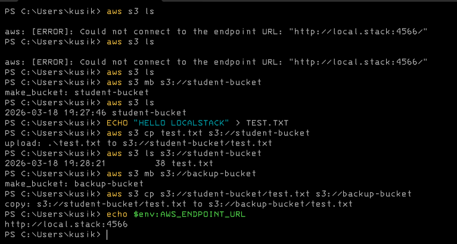

# Лабораторна робота №1

**Локальне адміністрування хмарних сервісів за допомогою LocalStack**

Дисципліна: **Системне адміністрування хмарних сервісів**

Виконав: студент групи 12-441 — Кусік Ілля Анатолійович

Івано-Франківськ, 2026

---

## МЕТА РОБОТИ

1. Навчитися працювати з контейнеризацією за допомогою Docker.
2. Запускати емуляцію AWS сервісів локально через LocalStack.
3. Керувати хмарними ресурсами через інтерфейс командного рядка AWS CLI.
4. Створювати та адмініструвати S3-сховище.

---

## КОРОТКІ ТЕОРЕТИЧНІ ВІДОМОСТІ

LocalStack — це програмне забезпечення, яке емулює роботу хмарних сервісів AWS у локальному середовищі. Це дозволяє розробникам та адміністраторам тестувати хмарну інфраструктуру без фінансових витрат та ризику пошкодити реальні ресурси.

LocalStack працює всередині контейнера Docker, що забезпечує ізольоване середовище з усіма необхідними залежностями. Для взаємодії з локальними хмарними сервісами використовується стандартний інструмент AWS CLI, який підключається до LocalStack за допомогою параметра `--endpoint-url`.

Docker Compose — інструмент для декларативного опису та запуску багатоконтейнерних Docker-застосунків. Конфігурація описується у файлі `docker-compose.yml`, після чого середовище запускається однією командою.

---

## ХІД РОБОТИ

### Підготовка середовища

На локальній машині (Windows) встановлено Docker Desktop, який надає повноцінне середовище Docker разом з підтримкою Docker Compose.

Для запуску LocalStack підготовлено файл `docker-compose.yml`:

```yaml
services:
  localstack:
    image: localstack/localstack:4.0
    container_name: localstack-main
    ports:
      - "127.0.0.1:4566:4566"
    environment:
      - DEBUG=0
    volumes:
      - localstack_data:/var/lib/localstack
      - /var/run/docker.sock:/var/run/docker.sock

volumes:
  localstack_data:
```

Контейнер прослуховує порт 4566 на інтерфейсі `127.0.0.1` (тільки localhost). Том `localstack_data` забезпечує збереження стану між перезапусками контейнера.

### Запуск LocalStack

З директорії `lab_1/` контейнер запущено у фоновому режимі:

```powershell
docker compose up -d
```

Перевірка стану:

```powershell
docker compose ps
```

Результат: контейнер `localstack-main` запущено і доступний на `http://localhost:4566`.

### Налаштування AWS CLI

Оскільки LocalStack емулює AWS, справжні ключі не потрібні — приймаються будь-які непорожні значення. Конфігураційні файли AWS CLI згенеровано за допомогою PowerShell.

Створення файлу credentials:

```powershell
New-Item -ItemType Directory -Force -Path "$env:USERPROFILE\.aws"
@"
[default]
aws_access_key_id = test
aws_secret_access_key = test
"@ | Set-Content "$env:USERPROFILE\.aws\credentials"
```

Створення файлу config:

```powershell
@"
[default]
region = us-east-1
output = json
"@ | Set-Content "$env:USERPROFILE\.aws\config"
```

Щоб при кожному виклику команди `aws` не вказувати параметр `--endpoint-url`, задано змінну середовища:

```powershell
$env:AWS_ENDPOINT_URL = "http://localhost:4566"
```

### Робота з AWS CLI (адміністрування S3-сховища)

**1. Створення S3 bucket:**

```bash
aws s3 mb s3://student-bucket
```

**2. Перевірка створеного сховища:**

```bash
aws s3 ls
```

Результат: виведено список існуючих bucket-ів, серед яких присутній `student-bucket`.

**3. Створення тестового файлу:**

```bash
echo "HELLO LOCALSTACK" > TEST.TXT
```

**4. Завантаження файлу у S3 bucket:**

```bash
aws s3 cp TEST.TXT s3://student-bucket
```

**5. Перевірка наявності файлу у сховищі:**

```bash
aws s3 ls s3://student-bucket
```

Результат: у списку об'єктів сховища успішно відобразився файл `TEST.TXT`.

**6. Додаткове завдання. Резервний bucket:**

```bash
aws s3 mb s3://backup-bucket
aws s3 cp s3://student-bucket/TEST.TXT s3://backup-bucket
```

На рис. 1 наведено знімок екрану з результатами виконання всіх команд у середовищі PowerShell.



---

## ВИСНОВКИ

Під час виконання лабораторної роботи успішно розгорнуто локальний емулятор хмарних сервісів LocalStack з використанням Docker Compose на локальній машині під управлінням Windows.

Завдяки декларативному підходу `docker-compose.yml` запуск повного середовища зводиться до однієї команди `docker compose up -d`. LocalStack слухає порт 4566 на інтерфейсі localhost, а AWS CLI налаштовано для роботи з ним через змінну середовища `AWS_ENDPOINT_URL`.

За допомогою AWS CLI успішно протестовано базовий функціонал сервісу S3: створено bucket, завантажено текстовий файл та перевірено його наявність у сховищі. Мета лабораторної роботи повністю досягнута.
