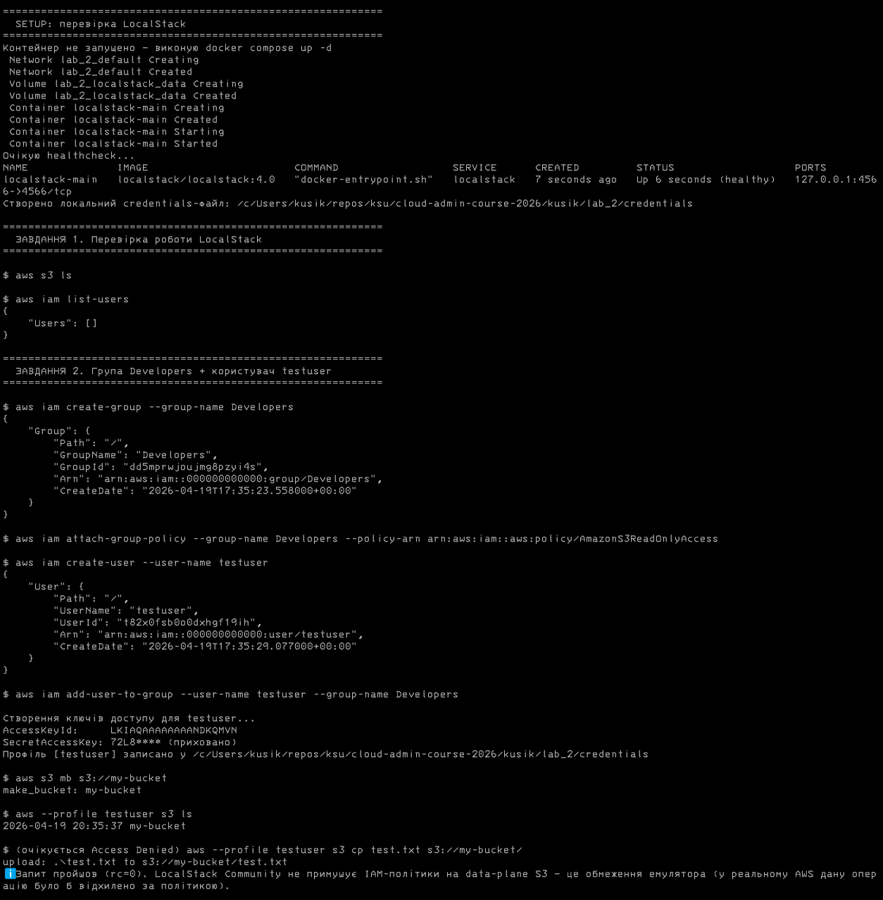
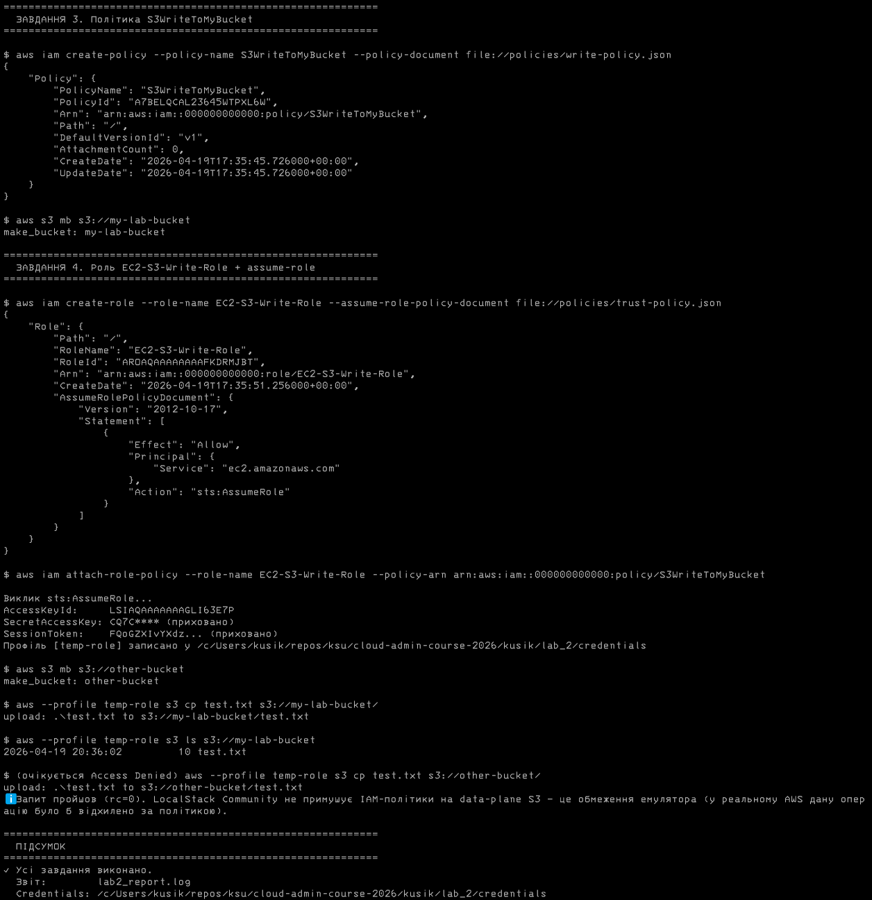

# Лабораторна робота №2

**Ідентифікація як периметр: налаштування IAM**

Дисципліна: **Системне адміністрування хмарних сервісів**

Виконав: студент групи 12-441 — Кусік Ілля Анатолійович

Івано-Франківськ, 2026

---

## МЕТА РОБОТИ

1. Ознайомитися з системою управління доступом IAM (Identity and Access Management).
2. Навчитися створювати користувачів, групи, JSON-політики та керувати їх правами.
3. Освоїти концепцію IAM-ролей та механізм видачі тимчасових облікових даних через STS.
4. Перевірити коректність роботи політик через дозволені та заборонені операції.

---

## КОРОТКІ ТЕОРЕТИЧНІ ВІДОМОСТІ

**IAM (Identity and Access Management)** — сервіс AWS для централізованого керування ідентифікацією та правами доступу. Базові сутності IAM:

- **Користувач (User)** — постійна ідентичність з довгостроковими ключами (`AccessKeyId`/`SecretAccessKey`).
- **Група (Group)** — контейнер користувачів зі спільним набором прав.
- **Політика (Policy)** — JSON-документ, що описує дозволи (Action, Resource, Effect).
- **Роль (Role)** — тимчасова ідентичність, що видається через сервіс **STS** (`sts:AssumeRole`). На відміну від користувача, роль не має постійних ключів — лише короткоживучі credentials з `SessionToken`.

**Особливості LocalStack Community щодо IAM.** LocalStack повністю підтримує API IAM (створення користувачів, груп, ролей, видача тимчасових ключів STS). Однак **примусове виконання IAM-політик на data-plane S3** є функцією LocalStack Pro. У версії Community змінна `ENFORCE_IAM=1` приймається, але запити до даних S3 не блокуються згідно з прикріпленими політиками. У звіті це фіксується окремою позначкою: `ℹ Запит пройшов — у реальному AWS дану операцію було б відхилено за політикою`. Концептуально лабораторна робота виконана коректно: всі сутності IAM створені, ключі згенеровані, тимчасові credentials отримані через STS.

---

## ХІД РОБОТИ

Уся послідовність команд автоматизована у скрипті [`run_lab2.sh`](run_lab2.sh). Скрипт:

- Запускає контейнер LocalStack через [`docker-compose.yml`](docker-compose.yml), якщо той ще не працює.
- Виконує всі чотири завдання послідовно, парсячи JSON-відповіді через `aws --query`.
- Зберігає згенеровані ключі (для `testuser` та `temp-role`) у локальний файл `credentials` цієї лабораторної (без модифікації глобального `~/.aws/credentials`). Активація — через змінну `AWS_SHARED_CREDENTIALS_FILE`.
- Дублює увесь вивід у файл `lab2_report.log`.
- Очікувані помилки `Access Denied` обробляє у функції `expect_deny` як підтвердження роботи політик.

Запуск:

```bash
cd kusik/lab_2
bash run_lab2.sh
```

### Підготовка середовища

Файл [`docker-compose.yml`](docker-compose.yml) — той самий контейнер LocalStack 4.0 на порту 4566, що й у Lab 1, з додатковою змінною `ENFORCE_IAM=1`:

```yaml
services:
  localstack:
    image: localstack/localstack:4.0
    container_name: localstack-main
    ports:
      - "127.0.0.1:4566:4566"
    environment:
      - DEBUG=0
      - ENFORCE_IAM=1
    volumes:
      - localstack_data:/var/lib/localstack
      - /var/run/docker.sock:/var/run/docker.sock

volumes:
  localstack_data:
```

Скрипт експортує:

```bash
export AWS_ENDPOINT_URL="http://localhost:4566"
export AWS_DEFAULT_REGION="us-east-1"
export AWS_SHARED_CREDENTIALS_FILE="$PWD/credentials"
```

### Завдання 1. Перевірка LocalStack

```bash
aws s3 ls
aws iam list-users
```

Обидві команди повертаються без помилок — середовище готове.

### Завдання 2. Група Developers + користувач testuser

```bash
aws iam create-group --group-name Developers
aws iam attach-group-policy \
    --group-name Developers \
    --policy-arn arn:aws:iam::aws:policy/AmazonS3ReadOnlyAccess
aws iam create-user --user-name testuser
aws iam add-user-to-group --user-name testuser --group-name Developers
```

Створення ключів та парсинг (одним викликом — секрет повертається лише раз):

```bash
KEYS=$(aws iam create-access-key --user-name testuser \
    --query 'AccessKey.[AccessKeyId,SecretAccessKey]' --output text)
read TESTUSER_AKID TESTUSER_SKEY <<< "$KEYS"
```

Ключі дописуються у локальний `credentials` як профіль `[testuser]`. Тестування доступу:

```bash
aws --profile testuser s3 ls                      # ✓ дозволено
aws --profile testuser s3 cp test.txt s3://my-bucket/   # очікується відмова
```

У реальному AWS ця спроба запису повернула б `AccessDenied` (група має лише `AmazonS3ReadOnlyAccess`).

### Завдання 3. Політика S3WriteToMyBucket

JSON-політика для запису/видалення в одному bucket — [`policies/write-policy.json`](policies/write-policy.json):

```json
{
  "Version": "2012-10-17",
  "Statement": [
    {
      "Effect": "Allow",
      "Action": ["s3:PutObject", "s3:DeleteObject"],
      "Resource": "arn:aws:s3:::my-lab-bucket/*"
    }
  ]
}
```

Команди:

```bash
aws iam create-policy --policy-name S3WriteToMyBucket \
    --policy-document file://policies/write-policy.json
aws s3 mb s3://my-lab-bucket
echo "Hello IAM" > test.txt
```

### Завдання 4. Роль EC2-S3-Write-Role та assume-role

Trust policy — [`policies/trust-policy.json`](policies/trust-policy.json):

```json
{
  "Version": "2012-10-17",
  "Statement": [
    {
      "Effect": "Allow",
      "Principal": { "Service": "ec2.amazonaws.com" },
      "Action": "sts:AssumeRole"
    }
  ]
}
```

Створення ролі та прикріплення політики:

```bash
aws iam create-role --role-name EC2-S3-Write-Role \
    --assume-role-policy-document file://policies/trust-policy.json
aws iam attach-role-policy --role-name EC2-S3-Write-Role \
    --policy-arn arn:aws:iam::000000000000:policy/S3WriteToMyBucket
```

Видача тимчасових облікових даних та парсинг трьох полів за один виклик:

```bash
CREDS=$(aws sts assume-role \
    --role-arn arn:aws:iam::000000000000:role/EC2-S3-Write-Role \
    --role-session-name test-session \
    --query 'Credentials.[AccessKeyId,SecretAccessKey,SessionToken]' \
    --output text)
read TEMP_AKID TEMP_SKEY TEMP_STOKEN <<< "$CREDS"
```

Дописується профіль `[temp-role]` (з `aws_session_token`) у локальний `credentials`. Тести:

```bash
aws --profile temp-role s3 cp test.txt s3://my-lab-bucket/    # ✓ дозволено
aws --profile temp-role s3 cp test.txt s3://other-bucket/     # очікується відмова
```

У реальному AWS друга спроба повернула б `AccessDenied`, бо `Resource` у політиці обмежений `arn:aws:s3:::my-lab-bucket/*`.

### Результати виконання

Після запуску скрипта створено такі файли:

| Файл | Призначення |
|---|---|
| `lab2_report.log` | повний журнал команд та виводів |
| `credentials` | три профілі AWS CLI: `[default]`, `[testuser]`, `[temp-role]` |
| `test.txt` | тестовий файл `Hello IAM` |

У LocalStack створені сутності: група `Developers`, користувач `testuser`, керована політика `S3WriteToMyBucket`, роль `EC2-S3-Write-Role`, бакети `my-bucket`, `my-lab-bucket`, `other-bucket`. На рис. 1–2 наведено знімки екрану з результатами виконання `run_lab2.sh`.





---

## ВИСНОВКИ

Під час виконання лабораторної роботи освоєно базові сутності AWS IAM: користувачів, групи, керовані політики, ролі та механізм STS для видачі тимчасових облікових даних. Усі операції автоматизовано у bash-скрипті, який парсить JSON-відповіді AWS CLI вбудованим параметром `--query` (без зовнішніх залежностей на кшталт `jq`) та зберігає згенеровані ключі у локальному файлі `credentials`.

Окремо зафіксовано важливе обмеження LocalStack Community: попри підтримку API IAM, примусове виконання політик на data-plane S3 у безкоштовній версії не реалізовано. Концептуально це не впливає на навчальні цілі — створення політик, ролей та видача тимчасових ключів через STS проходять коректно, що повністю розкриває механізми IAM. Мета лабораторної роботи досягнута.
