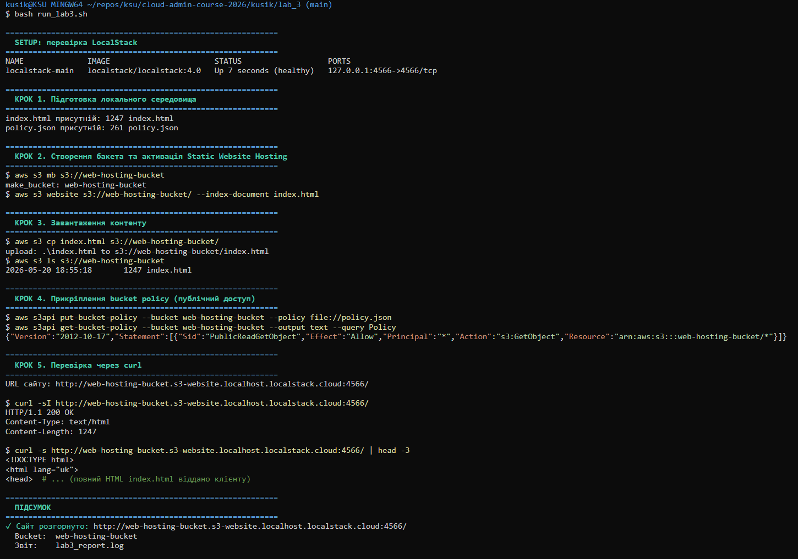
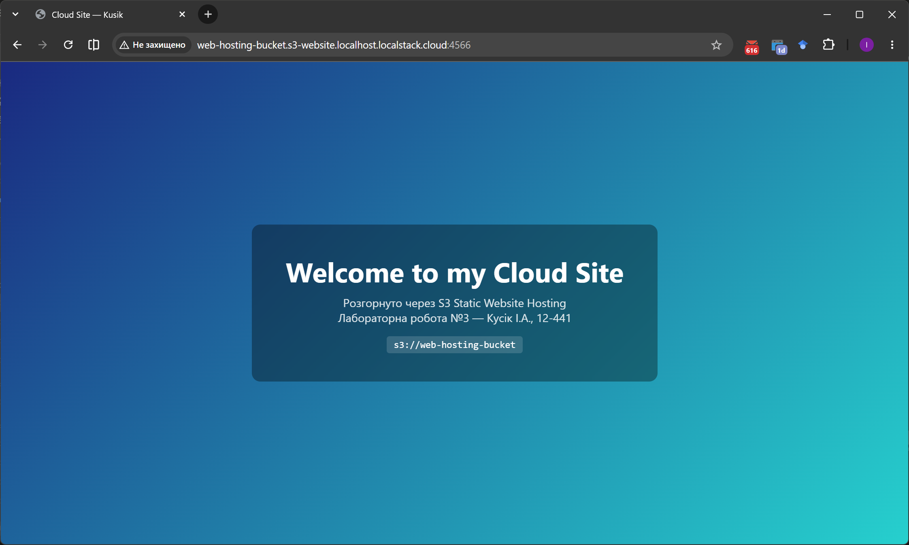

# Лабораторна робота №3

**Адміністрування статичного веб-хостингу та автоматизація доступу в Amazon S3**

Дисципліна: **Системне адміністрування хмарних сервісів**

Виконав: студент групи 12-441 — Кусік Ілля Анатолійович

Івано-Франківськ, 2026

---

## МЕТА РОБОТИ

1. Опанувати використання Amazon S3 як платформи для статичного веб-хостингу.
2. Навчитися активувати режим Static Website Hosting та задавати індексний документ.
3. Освоїти JSON-формат Bucket Policy для надання публічного доступу до об'єктів.
4. Автоматизувати розгортання сайту bash-скриптом і протестувати доступність через `curl`.

---

## КОРОТКІ ТЕОРЕТИЧНІ ВІДОМОСТІ

**Static Website Hosting на S3.** Окрім зберігання даних, S3-бакет може віддавати свій вміст HTTP-клієнтам як звичайний веб-сервер для статичних ресурсів (HTML, CSS, JS, зображення). Це усуває потребу в адмініструванні віртуальних машин (EC2): немає ОС, патчів і автоскейлінгу — лише `mb`, `cp`, `website`. У реальному AWS такий хостинг віддається через окремий ендпоінт виду `bucket.s3-website-region.amazonaws.com`.

**Bucket Policy.** За замовчуванням усі об'єкти у бакеті приватні — для них діє *implicit deny*. Щоб дозволити анонімне читання, до бакета прикріпляється **resource-based policy** у форматі JSON. Її чотири ключові поля:

| Поле | Значення для public-read сайту |
|---|---|
| `Effect` | `Allow` |
| `Principal` | `*` — будь-хто, включно з анонімами |
| `Action` | `s3:GetObject` — лише читання |
| `Resource` | `arn:aws:s3:::<bucket>/*` — усі об'єкти бакета |

**Відмінність bucket policy від IAM-політики:** перша прикріплюється до **ресурсу** (бакета) і відповідає на питання «кому я дозволяю звертатися до себе», друга — до **ідентичності** (user/role/group) і відповідає на «що мені дозволено робити».

**LocalStack ендпоінт сайту:** `http://<bucket>.s3-website.localhost.localstack.cloud:4566/`. Це домен, який LocalStack резолвить у `127.0.0.1` без потреби правити `hosts`.

---

## ХІД РОБОТИ

Уся послідовність команд автоматизована у скрипті [`run_lab3.sh`](run_lab3.sh). Запуск:

```bash
cd kusik/lab_3
bash run_lab3.sh
```

Скрипт експортує `AWS_ENDPOINT_URL=http://localhost:4566` та використовує тестові credentials (`test`/`test`). Увесь вивід дублюється у `lab3_report.log`.

### Крок 1. Локальні файли

Підготовлено два файли:

- [`index.html`](index.html) — стартова сторінка сайту з вітальним повідомленням.
- [`policy.json`](policy.json) — JSON-політика публічного читання (нижче).

### Крок 2. Створення бакета та активація хостингу

```bash
aws s3 mb s3://web-hosting-bucket
aws s3 website s3://web-hosting-bucket/ --index-document index.html
```

Параметр `--index-document index.html` каже LocalStack, який файл віддавати, коли клієнт запитує корінь сайту `/`.

### Крок 3. Завантаження контенту

```bash
aws s3 cp index.html s3://web-hosting-bucket/
aws s3 ls s3://web-hosting-bucket
```

### Крок 4. Bucket Policy — публічне читання

Файл [`policy.json`](policy.json):

```json
{
  "Version": "2012-10-17",
  "Statement": [
    {
      "Sid": "PublicReadGetObject",
      "Effect": "Allow",
      "Principal": "*",
      "Action": "s3:GetObject",
      "Resource": "arn:aws:s3:::web-hosting-bucket/*"
    }
  ]
}
```

Прикріплення політики до бакета:

```bash
aws s3api put-bucket-policy --bucket web-hosting-bucket --policy file://policy.json
aws s3api get-bucket-policy --bucket web-hosting-bucket --output text --query Policy
```

### Крок 5. Перевірка доступу

URL сайту: `http://web-hosting-bucket.s3-website.localhost.localstack.cloud:4566/`

```bash
curl -s http://web-hosting-bucket.s3-website.localhost.localstack.cloud:4566/
```

У відповідь повертається вміст `index.html`. Скрипт логує перші заголовки відповіді та сам HTML у `lab3_report.log`.

На рис. 1 наведено знімок виконання `run_lab3.sh` у Git Bash, на рис. 2 — відрендерену сторінку сайту у браузері.





---

## ПИТАННЯ ДЛЯ САМОКОНТРОЛЮ

**1. У чому перевага S3 над EC2 для хостингу статичного сайту?**
Не треба адмініструвати ОС, оновлення, веб-сервер (nginx/apache) і автомасштабування. S3 платний за об'ємом і трафіком; на EC2 платиш за час роботи інстансу навіть при нульовому навантаженні. S3 «зі скриньки» витримує величезні навантаження, бо це розподілене сховище.

**2. Що означає `Principal: "*"`?**
Будь-хто, включно з анонімними клієнтами (без AWS credentials). Інші варіанти: вказати конкретний account, IAM user або сервіс (`{"AWS": "arn:aws:iam::123:user/Bob"}`, `{"Service": "ec2.amazonaws.com"}`).

**3. Чи можна на S3 захостити сайт з PHP/БД?**
Ні. S3 віддає **статичні** файли як є — без виконання серверного коду. Для WordPress, PHP, Node.js потрібен сервер (EC2, ECS, Lambda) або готовий сервіс (Amplify, App Runner).

**4. Роль параметра `--index-document`?**
Каже S3, який файл повертати на запит кореня сайту (`/`) або підкаталогу. Без нього звернення до `/` поверне `404`. Аналогічно є `--error-document` — сторінка-заглушка для помилок.

**5. Як обмежити доступ за IP?**
Додати у Statement блок `Condition` з оператором `IpAddress`:
```json
"Condition": {
  "IpAddress": { "aws:SourceIp": ["203.0.113.0/24"] }
}
```
Усі запити з-поза цього діапазону отримають `AccessDenied`.

---

## ВИСНОВКИ

У результаті лабораторної роботи розгорнуто статичний веб-сайт на S3-бакеті, активовано режим Static Website Hosting та налаштовано публічне читання через bucket policy. Уся послідовність кроків автоматизована у bash-скрипті `run_lab3.sh`, що логує усі команди у `lab3_report.log`.

Доступність сайту підтверджено двома способами: `curl` повертає вміст `index.html` без credentials, а браузер коректно рендерить сторінку. На прикладі ключових полів JSON-політики (`Effect`, `Principal`, `Action`, `Resource`) продемонстровано принципову відмінність resource-based bucket policy від identity-based IAM-політики. Мета роботи досягнута.
